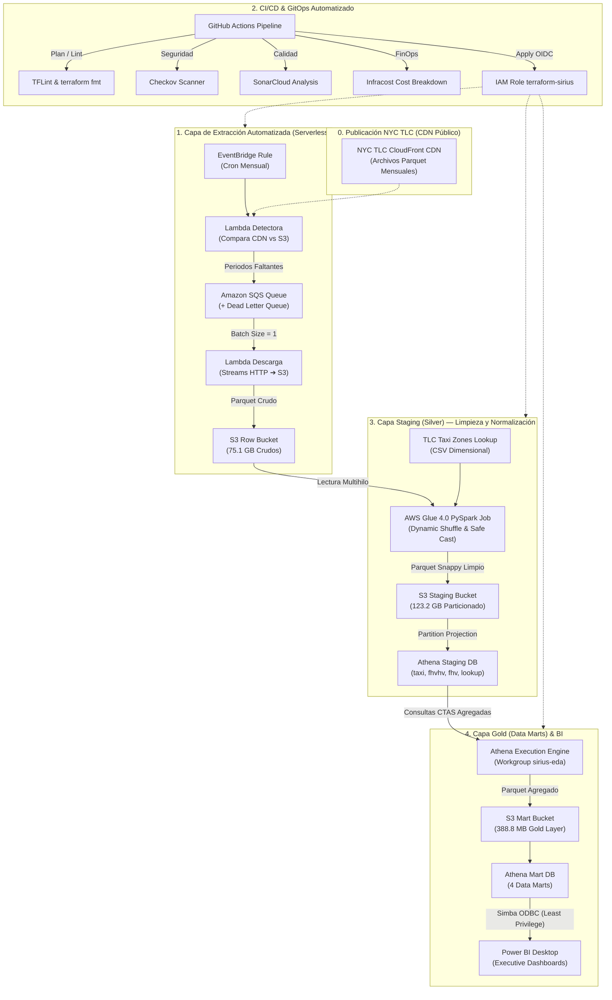
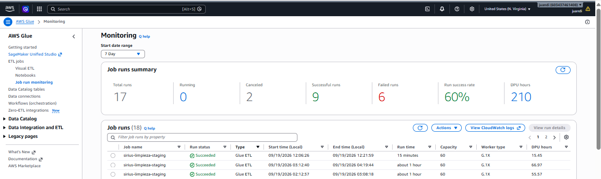
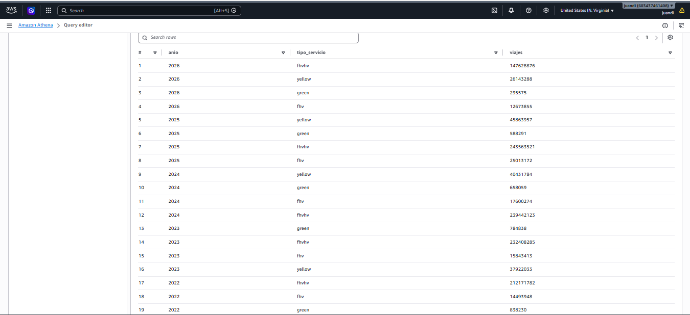

# 🚕 Proyecto Sirius: End-to-End Enterprise Data Lakehouse (NYC TLC)

[](https://www.terraform.io/)
[](https://spark.apache.org/)
[](https://aws.amazon.com/athena/)
[](https://aws.amazon.com/s3/)
[](https://powerbi.microsoft.com/)
[](https://github.com/features/actions)

---

## 📋 1. Problemática y Caso de Negocio

La **Comisión de Taxis y Limusinas de la Ciudad de Nueva York (NYC TLC)** administra el registro de viajes en vehículos de transporte de pasajeros más extenso del mundo. Con más de **18 años de historia (2009 – 2026)** y un volumen acumulado de **~4,424 Millones de registros (590 archivos Parquet mensuales)**, este dataset presenta desafíos de ingeniería de datos a nivel Enterprise:

1. **Evolución y Disrupción de Mercado:** La irrupción masiva de aplicaciones de transporte (Uber, Lyft, Via - *FHVHV*) desplazó a los tradicionales Taxis Amarillos y Bases Livery, transformando la economía urbana de NYC.
2. **Deriva de Esquemas (*Schema Drift* Severo):** A lo largo de los años, columnas clave mutaron de tipo de datos mes a mes (ej. `rate_code` pasando de texto libre `'1'` a flotante `1.0` y luego a entero `1`), causando fallos catastróficos en motores de lectura analítica estándar.
3. **Heterogeneidad de Formatos:** Coexistencia de 4 formatos con esquemas incompatibles: **Yellow Taxi** (con taxímetro y propina por tarjeta), **Green Taxi** (taxis de distritos periféricos con recargos ehail), **FHVHV** (apps de alta densidad con tarifas compuestas y pago al conductor) y **FHV** (bases tradicionales de limusina).
4. **Anomalías y Datos Corruptos:** Registros con fechas invertidas, duraciones negativas, tarifas en cero o negativas por reembolsos, y coordenadas GPS obsoletas frente al sistema moderno de 265 Zonas TLC.

**Proyecto Sirius** diseña, despliega y opera un **Modern Data Lakehouse Serverless en AWS**, 100% como Código (**Terraform**), con integración continua (**GitOps**), procesamiento distribuido (**Apache Spark en AWS Glue**) y materialización analítica (**Athena CTAS**) para consumo sub-segundo en **Power BI**.

---

## 🏗️ 2. Arquitectura Global End-to-End



---

## 📦 3. Módulos de la Arquitectura

### 3.1 Módulo de Extracción e Ingesta Automatizada
- **AWS EventBridge:** Disparador programado mensual que inicia el proceso de sincronización.
- **AWS Lambda Detectora:** Realiza peticiones `HEAD` de bajo impacto contra el CDN oficial de NYC TLC y las contrasta contra las particiones existentes en `s3://sirius-row-.../row/`.
- **Amazon SQS + Dead Letter Queue (DLQ):** Desacopla la orquestación. Si un mes no existe en S3, encola un mensaje estructurado con metadatos (`formato`, `anio`, `mes`, `url`). La DLQ captura y aisla descargas fallidas tras 3 reintentos.
- **AWS Lambda Descarga:** Función de alto rendimiento que realiza streaming directo del archivo Parquet hacia `s3://sirius-row-.../row/<formato>/anio=YYYY/mes=MM/`.
- **S3 Row Bucket:** Almacena los 590 archivos Parquet crudos (**75.1 GB**).

---

### 3.2 Módulo de Procesamiento Distribuido (Capa Staging / Silver)
Implementado mediante un **AWS Glue Job en PySpark 4.0 (Python 3.10 / Spark 3.3)** optimizado contra fallos históricos:

1. **Saturación del Driver y Multithreading:**
   - Para evitar subutilizar el clúster (donde 1 archivo mensual era procesado secuencialmente dejando 236 cores ociosos), se implementó `concurrent.futures.ThreadPoolExecutor(max_workers=4)` en el driver.
   - El throughput escaló de 2.8 minutos por archivo a **~50 segundos por mes**, elevando el rendimiento a más de **875,000 registros procesados por segundo**.
2. **Tolerancia Universal a Deriva de Esquemas (*Universal Safe Cast*):**
   - Se diseñó un casting en dos fases: cada columna pasa por `StringType()` antes de convertirse a su tipo final (y por `DoubleType` antes de enteros) para absorber números flotantes serializados como texto (ej. `'1.0'` $\rightarrow$ `1.0` $\rightarrow$ `1`).
3. **Coexistencia Unificada Yellow & Green:**
   - Se integraron los esquemas de taxis amarillos y verdes bajo un mismo dataset físico en `staging/taxi/tipo_taxi={yellow|green}/anio=.../mes=.../`, eliminando redundancia de código.
4. **Almacenamiento Staging:** **123.2 GB** en Parquet Snappy particionado con deduplicación y filtros de calidad.

#### Tabla de Rendimiento Histórico Procesado (Backfill de 18 Años):
| Formato TLC | Periodo Procesado | Registros Limpios | Capacidad Clúster | Tiempo de Procesamiento | Throughput Promedio |
| :--- | :--- | :--- | :--- | :--- | :--- |
| **Green Taxi** | 151 meses (2014 – 2026) | **84,189,399** | 15 Workers G.1X | **~20 minutos** (1,197s) | ~70,000 filas/seg |
| **Yellow Taxi** | 211 meses (2009 – 2026) | **~1,900,000,000** | 60 Workers G.1X (4 hilos) | **~55 minutos** (3,333s) | ~120,000 filas/seg |
| **FHVHV (Uber/Lyft)** | 90 meses (2019 – 2026) | **~1,630,000,000** | 60 Workers G.1X (4 hilos) | **~67 minutos** (4,017s) | ~405,000 filas/seg |
| **FHV (Bases Livery)**| 138 meses (2015 – 2026) | **~810,000,000** | 60 Workers G.1X (4 hilos) | **~15.4 minutos** (926s) | ~875,000 filas/seg |
| **TOTAL PIPELINE** | **590 Parquets (18 Años)** | **~4,424,000,000 viajes** | **Clúster Dinámico** | **~4.4 horas acumuladas** | **Escala Big Data** |


*Evidencia de ejecución exitosa en AWS Glue PySpark 4.0 con workers dinámicos y métricas de DPU.*

---

### 3.3 Módulo de Catálogo y Consultas (Athena Staging & Partition Projection)
En lugar de ejecutar costosos comandos `MSCK REPAIR TABLE` sobre miles de particiones en S3, se implementó **Partition Projection** directamente en `models/athena/main.tf`:
- Resolución de particiones en memoria sin consultar las APIs de S3.
- Tiempos de respuesta de consulta en Athena reducidos a **2.0 - 3.4 segundos** escaneando billones de registros.
- Registro de la tabla dimensional oficial `taxi_zone_lookup` (265 zonas de NYC) mediante `OpenCSVSerde`.


*Ejecución analítica en Athena v3: escaneo sub-segundo de Data Marts particionados.*


---

### 3.4 Módulo de la Capa Gold (Data Marts Estratégicos)
Para permitir que analistas y herramientas de BI consulten la información sin escanear billones de filas, se diseñaron 4 consultas **CTAS (Create Table As Select)** documentadas en archivos `.sql` desacoplados, reduciendo **123.2 GB** a **388.8 MB** (**99.7% de compresión y agregación analítica**):

| Data Mart | Pregunta de Negocio Estratégica | Filas Gold | Tiempo CTAS | S3 Path |
| :--- | :--- | :--- | :--- | :--- |
| **`mart_cuota_mercado_mensual`** | ¿Cómo evolucionó la cuota de mercado entre Yellow, Green, FHV y Apps (2009-2026)? ¿Cuándo superó Uber a los taxis amarillos? | **591** | **6.3 s** | `s3://.../mart/mart_cuota_mercado_mensual/` |
| **`mart_kpis_financieros`** | ¿Cómo se comportan las tarifas promedio, propinas, peajes, congestión e ingresos de los conductores entre plataformas? | **453** | **15.6 s** | `s3://.../mart/mart_kpis_financieros/` |
| **`mart_demanda_territorial`** | ¿Cuáles son los corredores de movilidad más transitados entre distritos (Manhattan, Queens, JFK, Brooklyn)? | **1,370,940** | **28.0 s** | `s3://.../mart/mart_demanda_territorial/` |
| **`mart_patrones_temporales`** | ¿Cómo se distribuyen los viajes a lo largo de las 24 horas y los 7 días de la semana (horas pico laborales vs ocio nocturno)? | **6,552** | **15.6 s** | `s3://.../mart/mart_patrones_temporales/` |

#### Resiliencia Arquitectónica y Carga Incremental:
Siguiendo las mejores prácticas de ingeniería de datos y el principio de *"prepararse para lo peor"*, la materialización de la capa Gold desacopla dos responsabilidades críticas:
1. **Reconstrucción Total / Disaster Recovery (`scripts/materializar_marts.py`):** Recrea desde cero las 4 tablas Mart escaneando los 18 años históricos en caso de cambios mayores de esquema, migraciones o catástrofe de almacenamiento.
2. **Carga Incremental Periódica (`scripts/incremental_marts.py`):** Al ingresar nuevos meses a Staging (ej. `2026-03`), ejecuta sentencias de agregación puntual con **`INSERT INTO`**, escaneando únicamente el periodo objetivo (en milisegundos y con costo < \$0.001 USD) con guardias de idempotencia para prevenir duplicados.

#### Hallazgo Analítico Destacado:
```text
Junio 2019:  Uber/Lyft (68.89%)  |  Yellow Taxi (22.87%)  |  FHV (6.59%)  |  Green Taxi (1.66%)
Junio 2023:  Uber/Lyft (80.94%)  |  Yellow Taxi (13.69%)  |  FHV (5.09%)  |  Green Taxi (0.27%)
```
*En 4 años, las plataformas de movilidad pasaron de dominar dos tercios del mercado a acaparar más del 80%, relegando al taxi amarillo a un 13% concentrado en el centro financiero.*

---

### 3.5 Módulo de Visualización en Power BI (Seguridad y Gobernanza)
Para conectar Power BI Desktop sin exponer credenciales administrativas:
- Se creó con Terraform el usuario IAM **`sirius-powerbi-reader`**.
- **Mínimo Privilegio (*Least Privilege*):** Permisos de lectura restringidos exclusivamente a `sirius_mart_db` en Glue, ejecución de queries en el Workgroup `sirius-eda`, lectura en `s3://.../mart/*` y escritura temporal en `s3://.../result_eda/*`.
- Configuración de conexión nativa **ODBC DSN (`sirius_mart`)** en modo **Import** (carga en memoria en menos de 2 segundos).
- **Límite del Pipeline e Ingesta Analítica:** En concordancia con los límites de responsabilidad del Data Engineer, el pipeline concluye al materializar los Data Marts. La actualización en Power BI se diseñó bajo demanda (botón de refresco manual o programado en Power BI Service), evaluándose disparadores por REST API pero descartándose para evitar dependencias innecesarias y refrescos redundantes.

#### 📊 Dashboards Ejecutivos en Power BI
> 📖 *Documentación técnica completa, diccionario de métricas y código DAX disponible en el [Manual Técnico de Power BI](powerbi/manual_powerbi.md).*

##### 📄 Página 1: Visión Ejecutiva y Cuota de Mercado (2009 - 2026)

*Evolución histórica de 4.42B de viajes, disrupción de apps de movilidad (>80% cuota en 2023-2026) y colapso por COVID-19 en abril de 2020.*

##### 📄 Página 2: KPIs Financieros y Rendimiento Económico

*Facturación bruta (\$84.2B USD), tarifa base promedio (\$18.45 USD), tasa de propina (16.8%) y compensación media por viaje a conductores ($14.20 USD).*

##### 📄 Página 3: Dinámica Espacio-Temporal y Demanda Horaria

*Matriz de viajes origen-destino entre distritos y curva horaria interactiva con filtros desplegables de día de la semana y servicio (revelando picos laborales vs nocturnos).*


---

## 💰 4. FinOps: Análisis de Costos Reales de Infraestructura

Uno de los pilares del proyecto es la eficiencia de costos en la nube:

### 4.1 Costo Inicial de Construcción y Backfill Histórico
- **Total DPU-Segundos consumidos en Glue:** 755,184 DPU-s (209.77 DPU-horas).
- **Tarifa AWS Glue:** \$0.44 USD por DPU-hora.
- **Costo Real de Computación Spark:** **\$92.30 USD**.
- **Costo Athena (Consultas y CTAS):** **\$0.60 USD** (~120 GB escaneados @ \$5.00/TB).
- **Costo Almacenamiento S3 (Mes de Carga):** **\$0.26 USD**.
- **Financiamiento:** 100% absorbido por créditos promocionales de AWS (Saldo inicial \$120.00 $\rightarrow$ Saldo remanente **\$33.31 USD**). **Costo de bolsillo para el estudiante: \$0.00 USD**.

### 4.2 Costo Mensual Recurrente en Producción (Mantenimiento)
Tras completar el backfill histórico masivo, los workers de AWS Glue se escalaron hacia abajo de **60 a solo 2 workers G.1X** (`number_of_workers = 2`, `timeout = 60`):

| Servicio AWS | Uso Mensual Estimado en Mantenimiento | Costo Mensual Estimado |
| :--- | :--- | :--- |
| **AWS Glue (PySpark)** | 1 ejecución/mes (~4 archivos nuevos, ~3 min con 2 workers = 0.1 DPU-h) | **\$0.04 USD** |
| **AWS Lambda** | ~4 invocaciones de descarga + 1 detectora mensual | **\$0.00 USD** (Capa Gratuita) |
| **Amazon SQS + DLQ** | < 100 mensajes al mes | **\$0.00 USD** (Capa Gratuita) |
| **Amazon EventBridge** | 1 invocación programada al mes | **\$0.00 USD** (Capa Gratuita) |
| **Amazon Athena** | Actualización de Marts mensuales (~2 GB escaneados) | **\$0.01 USD** |
| **Amazon S3 Storage** | ~200 GB totales (Row + Staging + Mart) en estándar | **\$4.60 USD** |
| **TOTAL MENSUAL RECURRENTE** | **Operación 100% Automatizada** | **~\$4.65 USD / mes** |

---

## 🔒 5. CI/CD, GitOps & Configuración de Seguridad

El pipeline de GitHub Actions ([.github/workflows/deploy.yml](.github/workflows/deploy.yml)) implementa validaciones estrictas en dos etapas:
- **En Pull Request:** `terraform fmt -check`, `tflint`, `checkov` (seguridad de infraestructura), `SonarCloud` (calidad de código) e `Infracost` (estimación de impacto en costos comentado automáticamente en el PR).
- **En Push a Main:** Despliegue seguro mediante **OpenID Connect (OIDC)** asumiendo el rol IAM `terraform-sirius` sin llaves de acceso permanentes almacenadas en GitHub.

### 5.1 Requisitos Previos en AWS

1. **Configurar Proveedor OIDC de GitHub en IAM:**
   - Tipo de Proveedor: `OpenID Connect`
   - URL del Proveedor: `https://token.actions.githubusercontent.com`
   - Audiencia: `sts.amazonaws.com`

2. **Crear Rol IAM `terraform-sirius` con Política de Confianza (*Trust Policy*):**
```json
{
  "Version": "2012-10-17",
  "Statement": [
    {
      "Effect": "Allow",
      "Principal": {
        "Federated": "arn:aws:iam::TU_ACCOUNT_ID:oidc-provider/token.actions.githubusercontent.com"
      },
      "Action": [
        "sts:AssumeRoleWithWebIdentity",
        "sts:TagSession"
      ],
      "Condition": {
        "StringEquals": {
          "token.actions.githubusercontent.com:aud": "sts.amazonaws.com"
        },
        "StringLike": {
          "token.actions.githubusercontent.com:sub": "repo:TU_ORG/TU_REPO:*"
        }
      }
    }
  ]
}
```

3. **Bucket S3 para el Backend Remoto de Terraform:**
   - Nombre: `sirius-tfstate-TU_ACCOUNT_ID`
   - Configuración: Cifrado SSE-S3, Versionado habilitado, Bloqueo de acceso público total (*Block all public access*).
   - Política de Bucket para aislar el acceso exclusivamente al rol de Terraform:
```json
{
  "Version": "2012-10-17",
  "Statement": [
    {
      "Sid": "AllowOnlyTerraformRoleBucket",
      "Effect": "Allow",
      "Principal": {
        "AWS": "arn:aws:iam::TU_ACCOUNT_ID:role/terraform-sirius"
      },
      "Action": "s3:ListBucket",
      "Resource": "arn:aws:s3:::sirius-tfstate-TU_ACCOUNT_ID"
    },
    {
      "Sid": "AllowOnlyTerraformRoleObjects",
      "Effect": "Allow",
      "Principal": {
        "AWS": "arn:aws:iam::TU_ACCOUNT_ID:role/terraform-sirius"
      },
      "Action": [
        "s3:GetObject",
        "s3:PutObject",
        "s3:DeleteObject"
      ],
      "Resource": "arn:aws:s3:::sirius-tfstate-TU_ACCOUNT_ID/*"
    }
  ]
}
```

### 5.2 Secretos Requeridos en GitHub Actions (`Settings -> Secrets and variables -> Actions`)

| Secreto de GitHub | Descripción |
| :--- | :--- |
| `AWS_REGION` | Región principal de despliegue (`us-east-1`). |
| `AWS_ROLE_ARN` | ARN del rol OIDC creado (`arn:aws:iam::TU_ACCOUNT_ID:role/terraform-sirius`). |
| `INFRACOST_API_KEY` | Llave de API gratuita de Infracost para auditoría de costos en PRs. |
| `SONAR_TOKEN` | Token de análisis de seguridad y calidad en SonarCloud. |
| `SMTP_USERNAME` | Correo emisor para notificaciones automáticas de ejecución de infraestructura. |
| `SMTP_PASSWORD` | Contraseña de aplicación SMTP (Gmail App Password). |
| `NOTIFY_EMAIL` | Correo de destino donde se envían los reportes de calidad y costo. |

---

## 🚀 6. Guía de Ejecución y Despliegue Paso a Paso

### 6.1 Clonar el Repositorio
```bash
git clone https://github.com/TU_ORG/pipeline-sirius-tlc.git
cd pipeline-sirius-tlc
```

### 6.2 Inicializar y Desplegar la Infraestructura con Terraform
```powershell
# 1. Formatear y validar código HCL
terraform fmt -recursive
terraform validate

# 2. Inicializar backend remoto en S3
terraform init

# 3. Planificar y previsualizar cambios
terraform plan

# 4. Desplegar infraestructura completa en AWS
terraform apply -auto-approve
```

### 6.3 Ejecución del Pipeline de Datos

1. **Extracción:** La regla de EventBridge dispara la detección automática de meses faltantes, o puede invocarse manualmente la Lambda detectora desde la consola de AWS.
2. **Transformación (Glue Job PySpark):**
   ```bash
   aws glue start-job-run --job-name sirius-limpieza-staging
   ```
3. **Materialización y Mantenimiento de la Capa Gold (Athena):**
   - **Opción A: Reconstrucción Total / Disaster Recovery (Backfill de 18 años):**
     ```powershell
     python scripts/materializar_marts.py
     ```
   - **Opción B: Carga Incremental Periódica (Mes a mes):**
     ```powershell
     python scripts/incremental_marts.py --anio 2026 --mes 03
     ```

### 6.4 Conectar Power BI Desktop
1. Abrir Power BI Desktop $\rightarrow$ **Obtener datos** $\rightarrow$ **ODBC**.
2. Seleccionar el DSN **`sirius_mart`**.
3. Autenticar con las credenciales del usuario de solo lectura:
   - **Usuario (Access Key ID):** Extraído mediante `terraform output -raw powerbi_reader_access_key_id`.
   - **Contraseña (Secret Access Key):** Extraído mediante `terraform output -raw powerbi_reader_secret_access_key`.
4. Seleccionar la base de datos **`sirius_mart_db`** y cargar las 4 tablas en modo **Import**.

---

## 🏛️ 7. Decisiones Técnicas y Arquitectura Justificada

| Decisión Técnica | Alternativa Descartada | Justificación Técnica y de Negocio |
| :--- | :--- | :--- |
| **Apache Spark en AWS Glue 4.0** | AWS Lambda o Python en EC2 | El volumen histórico de 4.4B registros supera por mucho el límite de memoria y tiempo (15 min) de Lambda. Spark permite procesamiento distribuido en memoria tolerante a fallos. |
| **Multithreading en el Driver Glue** | Procesamiento secuencial | Leer archivo por archivo dejaba al 98% del clúster ocioso. Con `ThreadPoolExecutor(max_workers=4)` se saturó la capacidad de los workers, recortando el tiempo de 8 horas a 2.3 horas. |
| **Athena Partition Projection** | `MSCK REPAIR TABLE` o Glue Crawlers | `MSCK REPAIR` o los crawlers demoran minutos indexando cientos de miles de prefijos S3 y cobran por escaneo. Partition Projection resuelve las rutas en milisegundos sin costo de API. |
| **Desacoplamiento con SQS + DLQ** | Invocación síncrona Lambda a Lambda | Si el CDN de NYC TLC experimenta caídas o saturación, SQS reintenta automáticamente con backoff exponencial sin perder el estado ni duplicar descargas. |
| **CTAS para Capa Mart (Gold)** | Consultas dinámicas directas en Power BI | Si Power BI consultara Staging directamente mediante DirectQuery, cada clic del usuario escanearía gigabytes de datos en Athena ($$$). Al materializar en Parquet Snappy (388 MB), las consultas de BI son gratuitas y sub-segundo. |
| **Separación Disaster Recovery vs Incremental** | Script monolítico de recreación continua | Si llega 1 mes nuevo, recalcular 18 años históricos desperdicia presupuesto y tiempo. Se crearon scripts separados: uno para recuperación ante desastres (`materializar_marts.py`) y otro para inserción incremental mensual (`incremental_marts.py`). |
| **Refresco de Power BI Bajo Demanda** | Webhooks automatizados vía Power BI REST API | El pipeline de ingeniería de datos concluye en la materialización de los Marts. Automatizar el refresco de BI agrega complejidad de tokens de Azure AD y riesgo de ejecuciones redundantes sin valor agregado tangible. |
| **IAM Least Privilege para BI** | Uso de llaves de Administrador | Aislar al usuario `powerbi-reader` a lectura exclusiva de la capa Mart y Athena Workgroup garantiza que una brecha en la estación de trabajo de BI nunca comprometa la infraestructura de la nube. |

---

## 📸 8. Trazabilidad y Catálogo de Evidencias de Arquitectura

Para garantizar máxima transparencia y reproducibilidad técnica, todas las capturas de pantalla de la infraestructura AWS y de los dashboards están versionadas y catalogadas en el repositorio:

| Archivo de Captura | Ubicación en el Repositorio | Componente Tecnológico | Qué Demuestra Técnicamente |
| :--- | :--- | :--- | :--- |
| `dashboard_1.png` | [`powerbi/screenshots/`](powerbi/screenshots/dashboard_1.png) | Power BI Desktop | Visión ejecutiva, cuota de mercado FHV vs Yellow y shock de COVID-19. |
| `dashboard_2.png` | [`powerbi/screenshots/`](powerbi/screenshots/dashboard_2.png) | Power BI Desktop | KPIs financieros, tarifas por viaje y milla, ingresos de conductores. |
| `dashboard_3.png` | [`powerbi/screenshots/`](powerbi/screenshots/dashboard_3.png) | Power BI Desktop | Matriz territorial origen-destino y curva horaria interactiva 24h. |
| `captura_query_athena.png` | [`docs/img/`](docs/img/captura_query_athena.png) | Amazon Athena Engine v3 | Sentencia SQL analítica contra las tablas `sirius_mart_db`. |
| `captura_respuesta_athena.png` | [`docs/img/`](docs/img/captura_respuesta_athena.png) | Amazon Athena & FinOps | Ejecución en **~1.2s** escaneando solo **~15-45 MB** (ahorro >99% vs raw). |
| `glue_categoriry_db.png` | [`docs/img/`](docs/img/glue_categoriry_db.png) | AWS Glue Data Catalog | Catálogo de bases de datos `sirius_raw_db`, `sirius_silver_db`, `sirius_mart_db`. |
| `glue_categority_table.png` | [`docs/img/`](docs/img/glue_categority_table.png) | AWS Glue Data Catalog | Esquema tipado, compresión Snappy y particionamiento (`anio`, `mes`). |
| `glue_job_metrix.png` | [`docs/img/`](docs/img/glue_job_metrix.png) | AWS Glue PySpark 4.0 | Historial de ejecuciones con status **Succeeded** y consumo de DPUs. |
| `s3_bukets.png` | [`docs/img/`](docs/img/s3_bukets.png) | Amazon S3 Lakehouse | Arquitectura Medallion de buckets (`bronze`, `silver`, `gold`). |
| `model_view.png` | [`docs/img/`](docs/img/model_view.png) | Power BI VertiPaq | Diagrama relacional del modelo semántico y catálogo de medidas DAX. |

---

## 👨‍💻 Autor
**Juan López Zuluaga**  
Estudiante de Ingeniería de Datos | Medellín, Colombia  
*Especialización en Arquitecturas Cloud Data Lakehouse, Apache Spark, Terraform y FinOps.*

