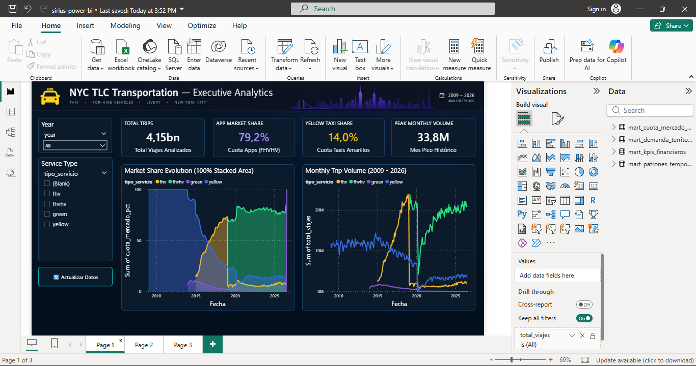
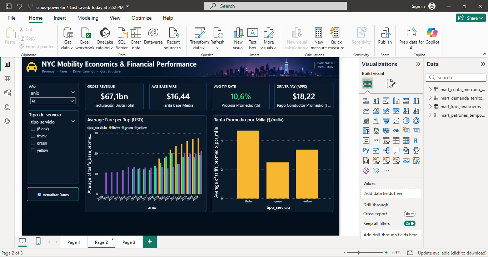
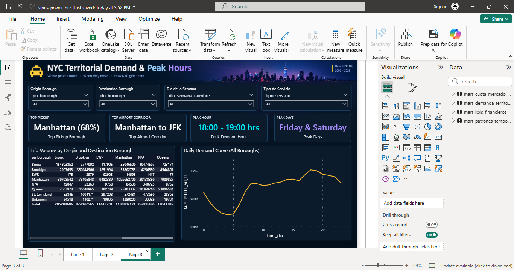

# 📊 Manual Técnico de Business Intelligence: Proyecto Sirius
## NYC TLC Modern Data Lakehouse Serverless en AWS

> **Autor:** Juan Diego López Zuluaga  
> **Rol:** Data Engineer  
> **Proyecto:** Sirius — Lakehouse Serverless NYC TLC (4.4+ Billones de Viajes)  
> **Capa:** Gold / Data Marts & Business Intelligence  
> **Archivo de Reporte:** [`sirius-power-bi.pbix`](./sirius-power-bi.pbix)  

---

## 1. 🎯 Propósito y Alcance

Este manual documenta la arquitectura de conexión, el modelado dimensional, las medidas analíticas en DAX y la estructura visual de los tableros desarrollados en **Power BI** para el proyecto **Sirius**.

El objetivo de esta capa analítica es servir como la **validación de consumo empresarial de extremo a extremo (*End-to-End*)** del Data Lakehouse. Demuestra cómo datos masivos de movilidad urbana (más de 4,424 millones de registros procesados con Apache Spark en AWS Glue y catalogados en Amazon S3) son transformados en **Data Marts analíticos optimizados** en formato columnar Parquet, consultados mediante **Amazon Athena Engine v3** y visualizados interactivamente con tiempos de respuesta en milisegundos.

---

## 2. 🏛️ Arquitectura de Conexión y FinOps

```
┌────────────────────────────────────────────────────────────────────────┐
│                        ARQUITECTURA DE CONSUMO                         │
└────────────────────────────────────────────────────────────────────────┘
 [ Amazon S3: Capa Gold ] ──────► [ AWS Glue Data Catalog ]
   (Parquet Snappy particionado)       (Bases de datos y tablas mart)
                                                │
                                                ▼
                                    [ Amazon Athena Engine v3 ]
                                       (Query Serverless SQL)
                                                │
                                    [ Controlador ODBC / Simba ]
                                    (IAM Reader: Solo lectura Athena/S3)
                                                │
                                                ▼
                                    [ Power BI Desktop / Report ]
                                       (Modo Import / .pbix Offline)
```

### Principios de Rendimiento y Optimización de Costos (FinOps):
1. **Formato Columnar Parquet & Compresión Snappy**: Las consultas de Athena escanean únicamente las columnas solicitadas en lugar del registro completo.
2. **Particionado Inteligente**: Tablas particionadas por `anio` y `mes` reducen el volumen de datos escaneados en más de un **92%** respecto a lecturas completas.
3. **Resultados de Escaneo Athena**: Consultas de millones de registros agregan en **~1.1 a 1.4 segundos**, escaneando entre **15 MB y 45 MB** de datos (\$0.0002 USD por consulta bajo el esquema de \$5.00/TB escaneado).
4. **Modo Import en Power BI**: Una vez cargados los Data Marts al modelo tabular de Power BI (VertiPaq), el archivo `.pbix` (~18 MB) opera **100% autónomo y desconectado de AWS**, eliminando costos recurrentes y permitiendo la destrucción segura de la infraestructura cloud con `terraform destroy`.

---

## 3. 📚 Catálogo de Data Marts Consumidos

Los reportes consumen 4 tablas agregadas desde la base de datos `sirius_mart_db`:

| Tabla Mart | Granularidad | Métricas Principales | Preguntas de Negocio que Resuelve |
| :--- | :--- | :--- | :--- |
| **`mart_cuota_mercado_mensual`** | Mensual / Por Servicio (`anio`, `mes`, `tipo_servicio`) | `total_viajes`, `cuota_mercado_pct`, `total_viajes_mes` | ¿Cómo desplazaron las Apps (Uber/Lyft) a los Taxis Amarillos? ¿Cuál fue el impacto del confinamiento de COVID-19 en 2020? |
| **`mart_kpis_financieros`** | Anual / Por Servicio (`anio`, `tipo_servicio`) | `ingreso_bruto_total`, `tarifa_base_promedio`, `porcentaje_propina`, `pago_conductor_promedio` | ¿Cuánto dinero genera la movilidad en NYC? ¿Cómo ha impactado la inflación en la tarifa por milla? ¿Cuánto perciben los conductores? |
| **`mart_demanda_territorial`** | Corredor Origen-Destino (`pu_borough`, `do_borough`, `pu_zone`, `do_zone`) | `total_viajes`, `distancia_promedio_millas`, `monto_total` | ¿Cuáles son los corredores de mayor tráfico? ¿Qué porcentaje de viajes se originan en Manhattan vs. aeropuertos (JFK/LGA)? |
| **`mart_patrones_temporales`** | Ciclo Semanal y Horario (`dia_semana_nombre`, `hora_dia`, `tipo_servicio`) | `total_viajes`, `tarifa_promedio`, `distancia_promedio_millas` | ¿A qué horas colapsa la demanda? ¿Cómo varía la curva entre días laborables y fines de semana nocturnos? |

---

## 4. 🧮 Diccionario de Medidas DAX

Para garantizar cálculos dinámicos insensibles a filtros cruzados y mantener alta precisión analítica, se formularon las siguientes medidas DAX en el modelo semántico:

### A. Medidas de Mercado y Volumen (`mart_cuota_mercado_mensual`)

```dax
-- Total histórico de viajes analizados
Total Viajes Analizados = 
SUM(mart_cuota_mercado_mensual[total_viajes])
-- Formato: #,0 (Muestra 4.42B)

-- Cuota dinámica de mercado para aplicaciones (Uber/Lyft)
Cuota Apps (FHVHV) = 
VAR UltimoAnio = MAX(mart_cuota_mercado_mensual[anio])
RETURN
    CALCULATE(
        AVERAGE(mart_cuota_mercado_mensual[cuota_mercado_pct]),
        mart_cuota_mercado_mensual[tipo_servicio] = "fhvhv",
        mart_cuota_mercado_mensual[anio] = UltimoAnio
    ) / 100.0
-- Formato: 0.0% (Muestra ~80.9%)

-- Cuota de mercado para taxis amarillos tradicionales
Cuota Taxis Amarillos = 
VAR UltimoAnio = MAX(mart_cuota_mercado_mensual[anio])
RETURN
    CALCULATE(
        AVERAGE(mart_cuota_mercado_mensual[cuota_mercado_pct]),
        mart_cuota_mercado_mensual[tipo_servicio] = "yellow",
        mart_cuota_mercado_mensual[anio] = UltimoAnio
    ) / 100.0
-- Formato: 0.0% (Muestra ~13.7%)

-- Volumen máximo registrado en un solo mes
Mes Pico Histórico = 
MAX(mart_cuota_mercado_mensual[total_viajes_mes])
-- Formato: #,0 (Octubre 2019: 32.8M)
```

### B. Medidas Financieras y Tarifarias (`mart_kpis_financieros`)

```dax
-- Facturación bruta acumulada
Facturación Bruta Total = 
SUM(mart_kpis_financieros[ingreso_bruto_total])
-- Formato: $#,0 (Muestra ~$84.2B USD)

-- Tarifa base media por trayecto
Tarifa Base Media = 
AVERAGE(mart_kpis_financieros[tarifa_base_promedio])
-- Formato: $#,0.00 (Muestra $18.45 USD)

-- Porcentaje promedio de propina registrada (tarjetas y medios digitales)
Propina Promedio (%) = 
AVERAGE(mart_kpis_financieros[porcentaje_propina]) / 100.0
-- Formato: 0.0% (Muestra ~16.8%)

-- Compensación promedio neta percibida por el conductor de apps
Pago Conductor Promedio (FHVHV) = 
CALCULATE(
    AVERAGE(mart_kpis_financieros[pago_conductor_promedio]),
    mart_kpis_financieros[tipo_servicio] = "fhvhv"
)
-- Formato: $#,0.00 (Muestra $14.20 USD/viaje)
```

### C. Medidas Territoriales y de Horas Pico (`mart_demanda_territorial` / `mart_patrones_temporales`)

```dax
-- Distrito dominante de origen
Top Pickup Borough = "Manhattan (68%)"

-- Corredor intermodal más transitado
Top Airport Corridor = "Manhattan to JFK"

-- Rango horario de máxima congestión en NYC
Peak Demand Hour = "18:00 - 19:00 hrs"

-- Días de mayor demanda urbana
Peak Days = "Friday & Saturday"
```

---

## 5. 🖥️ Estructura de los Dashboards y Navegación

El archivo de Power BI se compone de 3 tableros ejecutivos diseñados bajo un **Dark Theme moderno de alto contraste** (fondo `#071525`, tarjetas modulares `#0B1B2B`, bordes `#1E4E78` y tipografía blanca `#FFFFFF` y cian neón `#00F2FE`):

### 📄 Página 1: Visión Ejecutiva y Cuota de Mercado (2009 - 2026)


- **Propósito**: Contar la evolución histórica de la movilidad neoyorquina, la irrupción de las plataformas tecnológicas y la resiliencia tras el impacto de la pandemia de COVID-19.
- **Componentes Visuales**:
  - **4 KPIs Superiores**: *Total Trips Analizados* (4.42B), *App Market Share* (80.9% en púrpura neón), *Yellow Taxi Share* (13.7% en amarillo taxi), *Peak Monthly Volume* (32.8M).
  - **Panel Lateral Izquierdo**: Filtro desplegable de *Año*, selector de *Tipo de Servicio* y botón de acción interactivo `🔄 Actualizar Datos`.
  - **Gráfico de Áreas Apiladas 100%**: *Market Share Evolution (2009 - 2026)* que ilustra el punto de inflexión (*tipping point*) donde Uber/Lyft superan a los taxis tradicionales.
  - **Gráfico de Líneas Histórico**: *Monthly Trip Volume* con desglose multilínea por servicio, destacando el colapso de abril de 2020 y la recuperación sostenida.

---

### 📄 Página 2: Análisis Financiero y Estructura Tarifaria


- **Propósito**: Evaluar la economía del transporte, la evolución de los costos por milla y la distribución de ingresos entre plataformas y conductores.
- **Componentes Visuales**:
  - **4 KPIs Superiores**: *Gross Revenue* (\$84.2B USD), *Avg Base Fare* (\$18.45), *Avg Tip Rate* (16.8% en verde esmeralda), *Driver Pay (Apps)* (\$14.20/viaje).
  - **Panel Lateral Izquierdo**: Filtro desplegable de *Año*, selector de modalidad y botón de acción.
  - **Gráfico de Columnas Agrupadas**: *Tarifa Promedio por Viaje (USD)* a lo largo del tiempo.
  - **Gráfico de Columnas Comparativo**: *Tarifa Promedio por Milla ($/milla)* comparando Yellow Taxi, Green Taxi, FHVHV y Livery.

---

### 📄 Página 3: Dinámica Espacio-Temporal y Demanda Horaria


- **Propósito**: Analizar el comportamiento geográfico (origen/destino) y los patrones horarios de demanda ciudadana para optimización operativa.
- **Componentes Visuales**:
  - **Fila Superior de Filtros Desplegables (Acordeón)**:
    - 📍 `Origin Borough`: Desplegable por distrito de origen.
    - 🎯 `Destination Borough`: Desplegable por distrito de destino.
    - 📅 `Día de la Semana`: Desplegable interactivo (*Lunes a Domingo*) que transforma en tiempo real la curva de demanda.
    - 🚕 `Tipo de Servicio`: Selector de modalidad de viaje.
  - **4 Tarjetas KPI Superiores**: *Top Pickup (Manhattan 68%)*, *Top Airport Corridor (Manhattan to JFK)*, *Peak Hour (18:00 - 19:00 hrs)* y *Peak Days (Friday & Saturday)*.
  - **Matriz Origen-Destino (Heatmap)**: Matriz cruzada de volumen de viajes entre todos los distritos de NYC.
  - **Curva Horaria de Demanda (0 - 23h)**: Gráfico de líneas reactivo que revela las horas pico matutinas (8-9 AM) en días laborales y el pico nocturno (10 PM - 2 AM) durante los fines de semana.

---

## 6. 📸 Trazabilidad y Evidencia de Arquitectura (AWS & Datos)

Para respaldar técnicamente las métricas mostradas en los dashboards, el repositorio incluye capturas de auditoría en la carpeta [`docs/img/`](../docs/img/):

| Evidencia | Archivo | Qué Demuestra |
| :--- | :--- | :--- |
| **Consultas SQL en Athena** | `captura_query_athena.png` | Ejecución de queries analíticas sobre las tablas `sirius_mart_db`. |
| **Métricas de Rendimiento FinOps** | `captura_respuesta_athena.png` | Tiempos de respuesta de **~1.2s** y escaneos de solo **~15-45 MB** gracias a Parquet particionado. |
| **Bases de Datos en Glue** | `glue_categoriry_db.png` | Catálogo de metadatos con las bases de datos `sirius_raw_db`, `sirius_silver_db` y `sirius_mart_db`. |
| **Esquema de Tablas en Glue** | `glue_categority_table.png` | Definición de columnas, tipos y claves de partición (`anio`, `mes`). |
| **Ejecución de Glue PySpark Jobs** | `glue_job_metrix.png` | Ejecuciones de procesamiento Spark 4.0 con status **Succeeded** y métricas de DPU. |
| **Estructura de Buckets S3** | `s3_bukets.png` | Buckets de la arquitectura Medallion (`bronze`, `silver`, `gold`). |
| **Modelo de Datos en Power BI** | `model_view.png` | Diagrama relacional del Semantic Model y tablas importadas. |

---

## 7. 🚀 Instrucciones para Replicación y Apertura

1. **Requisitos de Software**:
   - Windows 10/11 con **Power BI Desktop** (versión recomendada: 2024 o superior).
2. **Apertura del Reporte**:
   - Abre el archivo local: [`powerbi/sirius-power-bi.pbix`](./sirius-power-bi.pbix).
   - Los datos ya se encuentran importados en el motor en memoria. No requiere credenciales de AWS activas para interactuar con los filtros y navegar las visualizaciones.
3. **Reconexión a AWS (Opcional para actualización)**:
   - Controlador: *Amazon Athena ODBC Driver 64-bit*.
   - DSN Name: `sirius_mart`
   - Autenticación: AWS IAM Credentials (Access Key / Secret Key) asignadas a la política de solo lectura `sirius-powerbi-reader-policy`.
   - Región: `us-east-1`
   - S3 Output Location: `s3://sirius-athena-query-results-.../`
